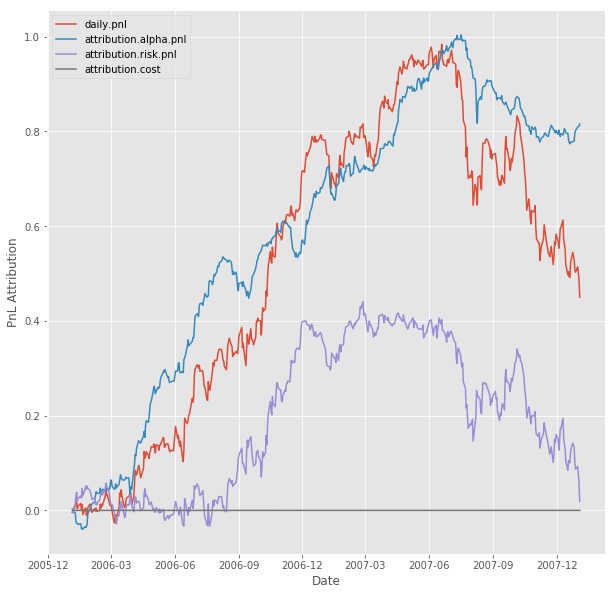
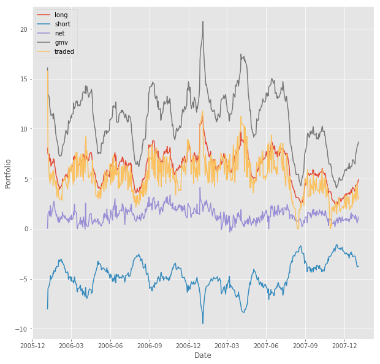

# Backtesting
---

This projects builds a computationally effecient backtester for a market neutral US Equities portfolio using Barra data for the period 2006-2007.

Alpha factors:
* **USFASTD_1DREVRSL** : Reversal

* **USFASTD_EARNYILD** : Earnings Yield

* **USFASTD_VALUE** : Value

* **USFASTD_SENTMT** : Sentiment

 

Focus is on:
* portfolio optimization accounting for transaction costs
 
 
 
* performance attribution to identify the major drivers portfolio's PnL

 